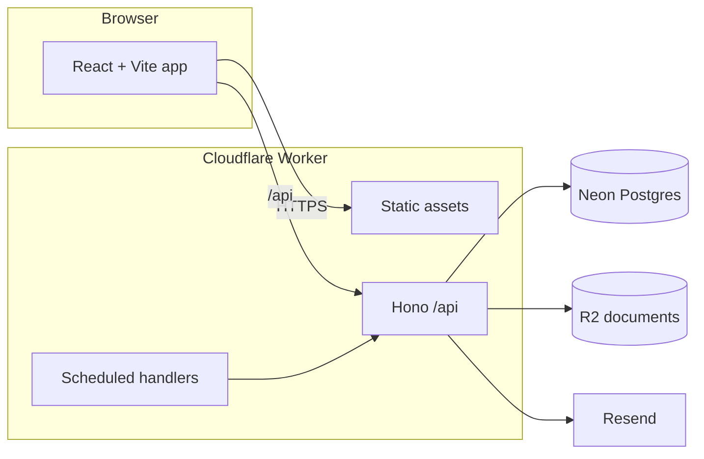

# InvoiceUI

Private invoicing for a single owner: draft and issue invoices, download PDFs, track payments, and keep historical documents immutable.

The browser app and API ship as **one Cloudflare Worker**. Neon stores the workspace. Private R2 holds issued PDFs and logos. Resend sends magic-link sign-in and invoice mail. Defaults are GBP and `Europe/London`; tax is opt-in.

**Status:** Fully implemented, verified, and deployed live to production at [invoiceui.humza.website](https://invoiceui.humza.website).

Production host: [invoiceui.humza.website](https://invoiceui.humza.website)


## Capabilities

- Owner-only passwordless sign-in (Better Auth magic links via Resend). Public registration is disabled.
- Business profile, clients, projects and saved services, copied by value into drafts so catalogue edits cannot rewrite issued invoices.
- Composer with live preview, debounced autosave, version conflict recovery, local offline drafts, discounts, optional tax, deposits and instalments.
- Atomic invoice numbering on issue; voided numbers are never reused.
- Direct PDF download in the Worker (`pdf-lib`), three templates (Studio, Minimal, Classic), optional work-breakdown document, Unicode filenames.
- Dashboard with lifecycle and payment filters, receivables by currency, auditable payment ledger and non-destructive void/archive.
- Resend email composer with editable templates, idempotent sending, verified webhooks, and public share links with instant revocation.
- Recurring schedule drafts with month-end anchor handling, and opt-in polite overdue reminders.
- Five mandatory UI libraries integrated across the product (`shadcn/ui`, `Motion`, `Magic UI`, `React Bits`, `Animate UI`) with documented provenance.
- Machine-readable workspace export (JSON format, schemaVersion 1) and ZIP archive containing issued PDFs.
- Tested restore procedure into isolated databases (`scripts/restore.mjs`) requiring `--empty-workspace-only` with automated public link revocation and schedule pause.

Out of current scope: Stripe/card collection, automatic FX conversion, and import of historical invoice folders.


## Architecture



| Layer | Role |
| --- | --- |
| `src/client` | Editor, preview, records, dashboard |
| `src/shared` | Domain model, decimal money, commands |
| `src/worker` | Auth, persistence, PDFs, delivery |
| `migrations` | Reviewed SQL applied by `npm run db:migrate` |

## Requirements

- Node.js 22+
- npm
- A Neon database for persistence
- Cloudflare account (Worker + R2) for API, assets and documents
- Resend account for email

## Local development

```bash
npm install
cp .dev.vars.example .dev.vars
```

Fill `.dev.vars` (never commit it). For authenticated local use, set `APP_URL` to `http://localhost:5173`.

Apply migrations:

```bash
npm run db:migrate
```

Run both frontend and backend concurrently in the same terminal:

```bash
npm run dev        # Runs client (Vite on 127.0.0.1:5173) and api (Wrangler on 127.0.0.1:8787)
```

Or run them individually if preferred:

```bash
npm run dev:client # Vite on 127.0.0.1:5173, proxies /api
npm run dev:api    # Wrangler on 127.0.0.1:8787
```

Open [http://127.0.0.1:5173](http://127.0.0.1:5173). Magic-link sign-in only succeeds for the configured owner email.

## Scripts

| Command | Purpose |
| --- | --- |
| `npm run dev` | Run frontend and backend together concurrently |
| `npm run dev:client` | Vite UI with `/api` proxy |
| `npm run dev:api` | Worker locally |
| `npm run check` | Typecheck |
| `npm test` | Vitest (no live database required) |
| `npm run build` | Production client + typecheck |
| `npm run db:migrate` | Apply SQL in `migrations/` |
| `npm run db:restore` | Restore into an isolated database |
| `npm run types` | Regenerate Wrangler `Env` types |
| `npm run dry-run` | Build and validate a Worker publish |
| `npm run deploy` | Build and deploy the Worker |
| `npm run sync:agents` | Refresh agent adapters from Cursor files |
| `npm run format` | Prettier |

## Configuration

Local secrets live in `.dev.vars`. Production secrets are Worker secrets, not Git.

| Name | Where | Purpose |
| --- | --- | --- |
| `DATABASE_URL` | `.dev.vars` / Worker secret | Neon connection string |
| `BETTER_AUTH_SECRET` | `.dev.vars` / Worker secret | Session signing, ≥32 characters |
| `RESEND_API_KEY` | `.dev.vars` / Worker secret | Magic links and invoice email |
| `RESEND_WEBHOOK_SECRET` | `.dev.vars` / Worker secret | Webhook signature verification |
| `APP_URL` | `wrangler.jsonc` `vars` | Public origin; override locally |
| `EMAIL_FROM` | `wrangler.jsonc` `vars` | Verified Resend from-address |
| `OWNER_EMAIL` | `wrangler.jsonc` `vars` | Sole allowed sign-in identity |
| `DOCUMENTS` | R2 binding | Private logos and issued PDFs |

Sanitised templates: `.dev.vars.example`. Real `.env`, `.env.local` and `.dev.vars` files are gitignored.

## Tests and quality

```bash
npm run check
npm test
npm run build
```

Tests use synthetic fixtures and fake provider credentials. Do not commit live invoices, customer dumps or production URLs in issues or fixtures.

## Deploy

1. Confirm Neon, R2 bucket `invoice-ui-documents`, Resend domain and Worker secrets.
2. `npm run db:migrate` against the target database (backup production data first).
3. `npm run dry-run`, then `npm run deploy`.
4. Attach `invoiceui.humza.website` to the Worker in Cloudflare.

Do not send real client email as a smoke test. Use a designated test recipient or mocked delivery.

## Documentation

| File | Contents |
| --- | --- |
| [IMPLEMENTATION_PLAN.md](IMPLEMENTATION_PLAN.md) | Numbered product requirements |
| [CURSOR_PROGRESS.md](CURSOR_PROGRESS.md) | What is implemented and verified |
| [docs/RELEASE_CHECKLIST.md](docs/RELEASE_CHECKLIST.md) | Production release checklist and operational handover |
| [docs/UI_COMPONENT_SOURCES.md](docs/UI_COMPONENT_SOURCES.md) | Mandatory UI libraries provenance matrix |
| [CONTRIBUTING.md](CONTRIBUTING.md) | Local workflow and pull requests |
| [SECURITY.md](SECURITY.md) | Vulnerability reporting |
| [AGENTS.md](AGENTS.md) | Shared agent instructions |
| [.ai/README.md](.ai/README.md) | How Cursor rules sync to other agents |


## Licence

Private software. See [LICENSE](LICENSE). All rights reserved.
